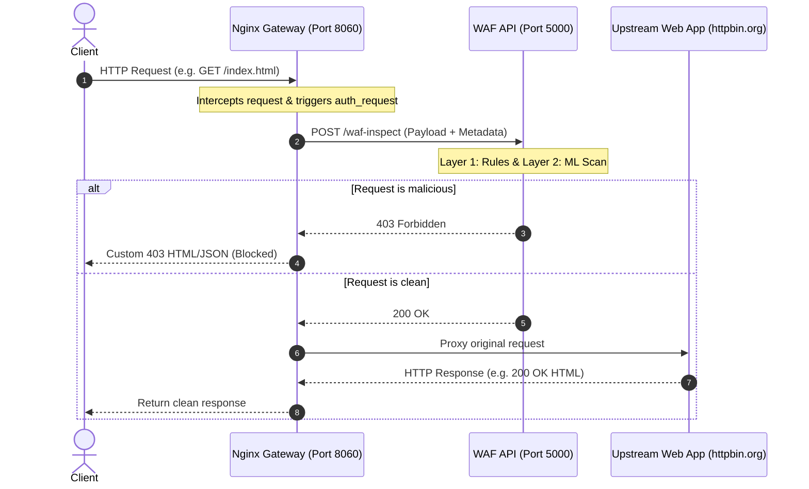
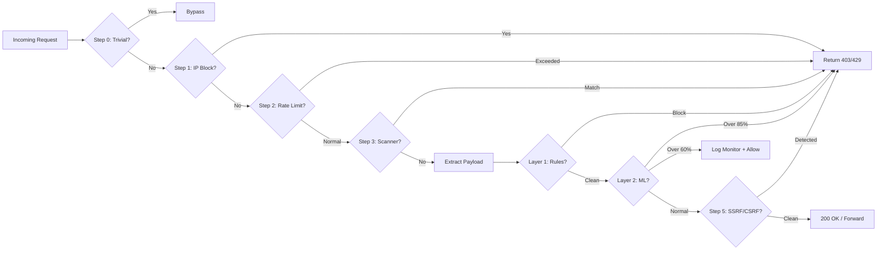
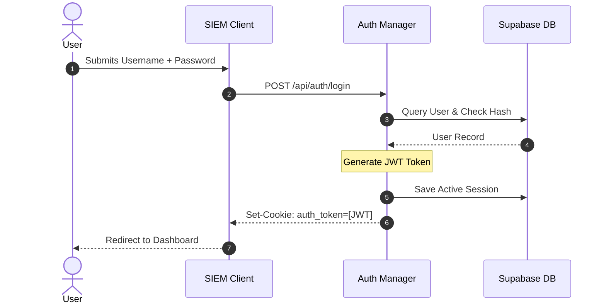
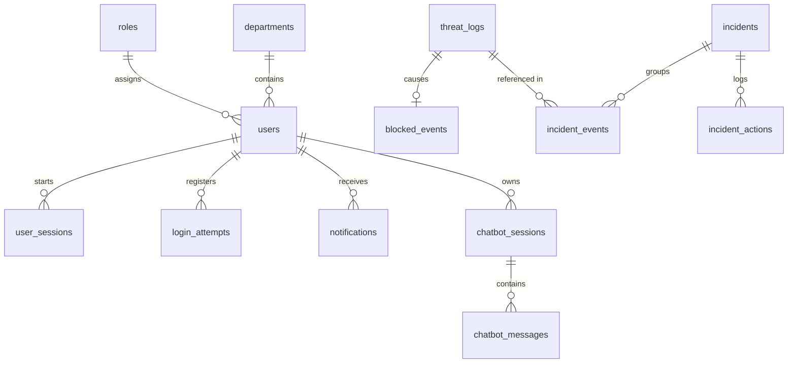
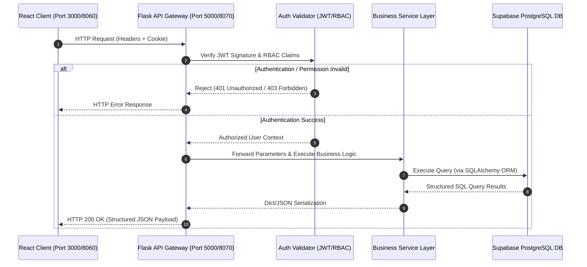
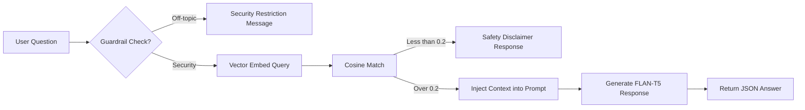
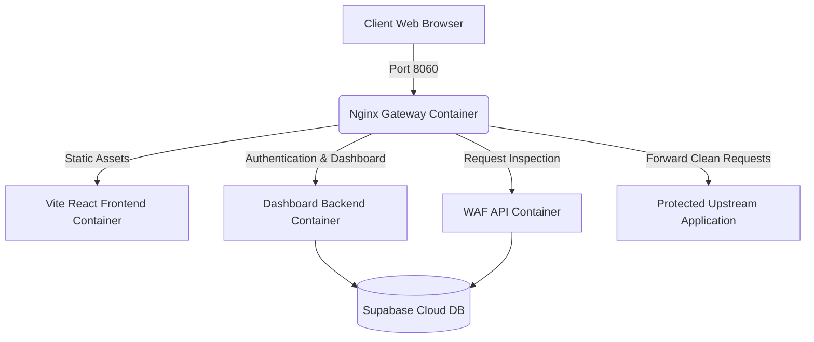

# Chapter 4: System Implementation

## 4.1 Introduction
This chapter details the technical implementation of the Virex Security System, a hybrid AI-powered Web Application Firewall (WAF) and Security Information and Event Management (SIEM) dashboard. It bridges theoretical security concepts with practical execution, detailing how traffic is intercepted, analyzed, blocked, logged, and visualized.

The implementation balances low-latency traffic proxying with deep-packet analysis, utilizing a dual-service architecture written in Python and JavaScript. This architecture separates the performance-critical WAF Inspection Engine from the data-intensive SIEM Dashboard and analytics pipeline. The following sections outline the development environment, the design of the interception gateway, the two-layer inspection logic (signature rules and Machine Learning), database structure, user interfaces, API endpoints, and multi-container deployment architecture.

## 4.2 Development Environment
To ensure a modern, robust, and scalable development lifecycle, the Virex Security System was engineered using standard open-source tools, modern frameworks, and cloud-native databases. The environment specifications are outlined below:

### Software & Hardware Specifications
- **Operating System:** Windows 11 Pro (Local Development & Testing) / Alpine Linux & Debian Slim (Containerized Production).
- **Programming Languages:** Python 3.11.x (Backend WAF & ML Engine), JavaScript ES6+ (Frontend SPA).
- **Integrated Development Environment (IDE):** VS Code / Cursor.

### Core Frameworks & Libraries

**Backend Services:**
- **Flask 3.0+:** Lightweight Web Server Gateway Interface (WSGI) framework used to implement both the WAF API server and the SIEM dashboard services.
- **SQLAlchemy 2.0+:** Object-Relational Mapper (ORM) for PostgreSQL database abstraction and thread-safe connection pooling.
- **PyJWT (Python JSON Web Tokens):** Used for secure, stateless client-side session management and validation.
- **Gunicorn (Green Unicorn) 21.2+:** Production-grade WSGI HTTP server executing multi-threaded Python workers.

**Machine Learning & Data Processing:**
- **LightGBM 4.4.0:** High-performance gradient boosting framework used to train the multi-class threat classification model, chosen for its efficiency with high-dimensional sparse datasets.
- **Optuna:** Bayesian optimization framework utilized to perform automated hyperparameter tuning (e.g., learning rate, num_leaves) to maximize the macro-F1 score.
- **Scikit-Learn 1.3+:** Utilized for dataset splitting, cross-validation, and fitting the Term Frequency-Inverse Document Frequency (TF-IDF) text vectorizer alongside the custom SecurityFeatureExtractor.
- **Pandas & NumPy:** High-performance data manipulation libraries for preprocessing CSV datasets and structuring vector arrays.
- **ONNX Runtime:** Open Neural Network Exchange runtime engine utilized for ultra-fast, cross-platform inference of serialized models.
- **Joblib:** For serializing and loading trained models, vectorizers, and label encoders.

**Frontend Dashboard:**
- **React 18.3+:** Declarative component-based UI library.
- **Vite 5.4+:** Frontend build tool and hot-reloading development server.
- **TailwindCSS 3.4+:** Utility-first CSS framework for interface styling and responsive grid layouts.
- **Chart.js & React-Chartjs-2:** Canvas-based data visualization library for rendering real-time graphs and charts.
- **Framer Motion 12.4+:** Animation library for micro-interactions, layout transitions, and toast alerts.

**Database & Caching:**
- **PostgreSQL 15 (Supabase):** Relational database hosting the application state, audit logs, system configurations, threat metrics, and user tables.
- **Redis:** Key-value data store used for sliding-window rate limit counters and caching ML prediction scores.

## 4.3 System Implementation

### 4.3.1 Reverse Proxy Implementation
The system utilizes Nginx as an edge reverse proxy gateway (listening on port 8060) acting as the single point of entry for all incoming client traffic. Rather than embedding the WAF logic directly inside Nginx (which can lead to maintenance overhead), Virex implements an inline subrequest verification model using Nginx's native `auth_request` module.

The architecture operates as follows:



**Key Technical Configurations in `nginx.conf`:**
- `auth_request /waf-inspect;`: Configured inside protected locations (like `/` or `/api/`) to force Nginx to make a synchronous subrequest to the internal validation route before forwarding the client's request.
- `proxy_pass_request_body on;`: Ensures the request body (JSON payloads, form parameters) is forwarded to the WAF engine for inspection.
- **Header Propagation:** Crucial metadata is forwarded using headers like `X-Original-URI` and `X-Original-Method` along with client details (`User-Agent`, `Cookie`, `X-Real-IP`).
- **Bypass Lists:** Static directories (like `/static/` or favicon) bypass inspection (`auth_request off;`) to optimize performance and prevent checking static assets.

### 4.3.2 WAF Engine Implementation
The WAF Inspection Engine is built in Python as a Flask application on port 5000. The core security logic is centralized within the `SimpleSecurityManager` class inside `security.py`.

When Nginx triggers a `/waf-inspect` subrequest, the WAF Engine initiates a 7-Layer inspection pipeline designed for maximum resilience:



**1. In-Memory IP Block Cache**
To prevent repetitive, expensive database scans from blocked IPs, the WAF maintains a temporary in-memory block list cache (`ip_cache`). If an IP is found in the cache and the block duration (default 120 seconds) hasn't expired, it is immediately denied.

**2. Centralized Rate Limiter**
The system employs a sliding-window rate limiting mechanism inside the `check_rate_limit()` method.
- **Redis Implementation:** Utilizes a Redis Sorted Set (ZSET) keyed by `rate_limit:<ip>`. Scores and values represent request timestamps. Old elements outside the sliding window (`now - window`) are cleared via `ZREMRANGEBYSCORE`. The length of the remaining set is checked using `ZCARD`. If it exceeds the maximum threshold, a block status is triggered.
- **Database Fallback:** If Redis is offline, the WAF drops back to a SQL query matching against the `rate_limits` table:
  ```sql
  DELETE FROM rate_limits WHERE ip_address = :ip AND timestamp < :cutoff;
  SELECT COUNT(*) FROM rate_limits WHERE ip_address = :ip;
  INSERT INTO rate_limits (ip_address, timestamp) VALUES (:ip, :ts);
  ```
- **Local Memory Fallback:** If the database is also unreachable, the limiter falls back to a thread-safe local queue (`defaultdict(deque)`) to ensure the WAF remains operational under degradation.

**3. Exhaustive Data Extraction**
To analyze the request, the WAF scrapes all potential attack vectors into a centralized dictionary `data_to_scan`:
- URL query parameters (`request.args`).
- JSON request body (`request.get_json(silent=True)`).
- Multimodal Form variables (`request.form`).
- Uploaded files metadata: file names and MIME types (`request.files`).
- Security-sensitive headers (`User-Agent`, `Referer`, `Cookie`, `Origin`, `X-Forwarded-For`).
- The raw URL path (`_url_path`).
- Raw binary POST/PUT body fallback.

**4. Layer 1: Database-Driven Rule Engine**
The extracted payload dictionary is recursively scanned using regular expressions stored in the database's `rules` table. Rules are pre-compiled and compiled regex patterns are cached in memory for rapid searching:
```python
compiled = re.compile(pattern, re.IGNORECASE | re.DOTALL)
```
- **Strict Handlers:** The engine includes dedicated, high-speed patterns for SQL Injection and Cross-Site Scripting (XSS) that bypass standard DB loops to guarantee interception of common payloads (e.g. `' UNION SELECT`, `alert(1)`, `<script>`).

**5. Layer 2: Machine Learning Anomaly Score**
If the payload passes all signature-based regex patterns, it is forwarded to the LightGBM ONNX inference module. The engine calculates a probability score using 3,052 extracted features and applies per-class thresholds (e.g., a strict 0.10 threshold for Log4Shell) to determine the final security action.

**6. SSRF & CSRF Checking**
The request details are passed to dedicated heuristic detection files:
- **`ssrf_rule.py`:** Detects internal IP queries, loopbacks (e.g., `127.0.0.1`, `localhost`, `169.254.169.254`), or private hostnames in query parameters.
- **`csrf_rule.py`:** Compares HTTP methods and validates cross-origin headers (`Referer`, `Origin`) against cookie states.

### 4.3.3 Machine Learning Module
The WAF utilizes a machine learning engine to detect zero-day vulnerabilities and obfuscated payloads that bypass static signatures. The engine is located in `inference.py`.

**Fast-Path Pre-Filter (False Positive Minimization)**
Executing ML inference for every single request introduces substantial latency and risk of false positives. To solve this, Virex implements a Fast-Path pre-filter using a highly optimized, pre-compiled regular expression:
```python
_FAST_SUSPICIOUS_REGEX = re.compile(
    r"['\"<>;|\${}()]|--|/\*|\*/|\b(?:select|union|insert|update|delete|drop|exec|xp_|script|javascript:|onerror|onload)\b",
    re.IGNORECASE
)
```
If the payload contains none of these control characters or security keywords, the engine skips ML execution entirely, returning a benign status. This guarantees a 0% false-positive rate for normal alphanumeric strings (like search inputs or usernames) and significantly reduces CPU overhead.

**Feature Engineering & Prediction Pipeline**
- **Text Normalization (`clean_text`):** Removes common HTTP metadata characters (`/`, `?`, `=`, `&`, `[`, `]`, `.`, `_`, `@`, `:`) to isolate the raw payload contents.
- **Dual-Stream Feature Extraction:** Transforms the normalized text using a character-level TF-IDF vectorizer (capped at 3,000 features) and merges it with a custom `SecurityFeatureExtractor` that calculates 52 distinct heuristic security indicators (e.g., entropy, encoding density, shell metacharacters), resulting in a 3,052-dimensional sparse vector.
- **LightGBM Classification:** The model utilizes a highly optimized LightGBM classifier with 145 estimators. Deployed via ONNX Runtime, it achieves an ultra-low inference latency of ~0.04ms. It computes the probability distribution across 9 attack classes and normal traffic.

**Threshold-Based Action Engine**
The classification output is mapped to system actions based on configured probability thresholds:
- **`risk_score >= THRESHOLD_BLOCK` (Default: 85%):** The request is flagged as a high-confidence attack, blocked (403), and logged.
- **`risk_score >= THRESHOLD_MONITOR` (Default: 60%):** The request is allowed through to minimize false blocks, but is flagged for analyst monitoring and logged to the ML feedback queue.
- **`risk_score < THRESHOLD_MONITOR`:** The request is classified as clean and allowed to pass.

**MLOps and Continuous Learning Pipeline**
To ensure the model adapts to emerging threats safely, the system implements a production-grade MLOps pipeline:
- **Drift Detection:** A scheduled daemon evaluates live traffic distributions against training baselines using the Population Stability Index (PSI) and Feature Z-Scores to identify concept drift.
- **Human-in-the-Loop Feedback:** Borderline predictions are logged to a pending queue. Analysts manually verify these anomalous payloads via the `FeedbackManager` before they are merged into the retraining dataset, effectively preventing data poisoning.
- **Automated Retraining Scheduler:** A daemon thread monitors multiple preconditions (e.g., drift flags, minimum verified feedback count). When triggered, it spawns an isolated subprocess to securely retrain the LightGBM model.
- **Champion-Challenger Gating:** Before deployment, a strict evaluator compares the newly trained candidate against the active production model. The new model is only promoted if it mathematically demonstrates zero regression across Accuracy, F1-Score, AUC, and False Positive Rates.

### 4.3.4 Dashboard Implementation
The SIEM Dashboard serves as the central administrative interface for monitoring threats and analyzing WAF telemetry. The frontend is built as a React Single Page Application (SPA) structured with Vite, and the backend is served by a dedicated Flask thread (port 8070).

**Core Frontend Architecture**
- **State Management:** React contexts are used to coordinate global state, including `AuthContext.jsx` (managing active login sessions) and `ToastContext.jsx` (rendering non-blocking toast notifications).
- **Micro-Animations:** Framer Motion is utilized to build responsive layouts, sliding sidebars, and animated KPI dashboards.
- **Charts Visualization:** Integrated with `react-chartjs-2` to display dynamic data feeds, such as:
  - **Traffic Trend Timeline:** Interactive line chart showing the ratio of normal vs. blocked requests.
  - **Attack Category Distribution:** Polar/doughnut charts mapping active attack types (e.g., SQLi, XSS).
  - **Attacking IPs:** Bar charts representing top source IPs.

**Incident Triage Workflow**
Threat logs are aggregated into single actionable Incidents based on matching IP addresses and attack categories. Analysts can:
- View grouped logs in a paginated grid.
- Update incident status (Open, Investigating, Resolved, Closed).
- Add internal notes and log remediation actions (which write to the `incident_actions` database table).
- Export structured PDF reports or block attacking IPs on the fly.

### 4.3.5 Authentication and Role-Based Access Control (RBAC)
Virex enforces robust authentication and authorization using a stateless JSON Web Token (JWT) architecture coupled with database-backed session verification.



**Token Security and Revocation**
- **Token Generation:** Generated upon successful login (`/api/auth/login`). The payload contains claims like `user_id`, `role_name`, and a unique cryptographic session ID (`jti`).
- **Stateless with Revocation:** To prevent token leakage exploits, the WAF validates the signature of the cookie-based token (HS256 algorithm) and verifies that its session identifier (`jti`) is active in the database:
  ```python
  jti_hash = hashlib.sha256(jti.encode()).hexdigest()
  active = db.is_session_active(jti_hash)
  ```
This design combines the speed of JWT verification with the control of server-side session revocation.

**Role-Based Access Control (RBAC)**
Users are mapped to distinct permissions:

| Role | Role ID | Access Level | Responsibilities |
|---|---|---|---|
| Admin | 1 | Full Read/Write | Full system configuration, user provisioning, WAF rules editing, and ML retraining. |
| User | 2 | Standard | View metrics, read logs, edit own profile. |
| Analyst | 3 | High-level View | Full access to threat logs and incident triage; cannot modify system settings or users. |
| Manager | 4 | Management | Administrative oversight of incidents and report review. |

**Route Protection Decorators**
Access is programmatically restricted at the route level using custom Python decorators:
- `@login_required`: Validates the JWT cookie/header and injects a `current_user` dictionary.
- `@admin_only`: Restricts endpoints to Role ID 1.
- `@analyst_and_above`: Grants access to Analysts and Admins.
- `@manager_and_above`: Grants access to Managers, Analysts, and Admins.

### 4.3.6 Database Implementation
The system stores its operational state in a PostgreSQL database (typically hosted via Supabase). The schema contains indexed relations designed to handle high-frequency writes (from WAF logs) and complex reads (for dashboard aggregates).



- **Audit Logging:** The `audit_logs` table logs administrative activities (e.g., editing rules, updating user permissions) to satisfy corporate compliance and traceability requirements.
- **Database Partitioning and Indexes:** High-load tables such as `threat_logs` and `rate_limits` feature primary indexation on fields like `ip_address`, `attack_type`, `created_at`, and `blocked` to maintain rapid queries as log volume expands.

## 4.4 User Interface
The Virex frontend is built as a React-based application designed for security operations. The user interface features are detailed below:

1. **Login View**
   - **Purpose:** Secure interface for user authentication.
   - **UI Elements:** Minimalist login form with input fields for username and password, floating validation errors, a password visibility toggle, a forgot password link, and a redirect to register.
   - **Interactivity:** Utilizes Framer Motion for fade-in animations. Form submission sends requests to `/api/auth/login` and writes the HttpOnly token cookie.

2. **Main Dashboard View**
   - **Purpose:** Real-time operational SIEM homepage.
   - **UI Elements:** A grid of metric cards displaying key performance indicators (KPIs): Total Requests, Blocked Attacks, Active Threat Level, and ML Precision Score. Includes a live interactive Chart.js line graph of request timelines, and threat type distribution charts.
   - **Interactivity:** Auto-refreshes data feeds every 10 seconds. Micro-animations update KPI numbers.

3. **Threat Logs View**
   - **Purpose:** Searchable table of intercepted requests.
   - **UI Elements:** A paginated data grid detailing attacker IP, HTTP method, requested URI, attack type, severity, blocking status, and date. Includes a universal search bar and category filters.
   - **Interactivity:** Features a detail drawer that slides open on row selection to display raw packet snippets and machine learning confidence scores.

4. **Incident Details View**
   - **Purpose:** Workflow panel for triaging security incidents.
   - **UI Elements:** Incident header displaying the unique incident code (e.g. INC-2026-XSS), source IP, status, and severity. Lists aggregated attack payloads, a timeline graph, an analyst comments section, and action logs.
   - **Interactivity:** Provides single-click buttons to change status, append notes, block the source IP, or dismiss the threat.

5. **Rules Management View**
   - **Purpose:** Administrative panel for editing regex rules.
   - **UI Elements:** List of current rules showing name, threat category, regex pattern, action (block vs. monitor), and status.
   - **Interactivity:** Features a popup modal with validation to create or edit rules. Toggling a switch updates the status of the rule in the database, triggering automatic reload by the WAF API server.

6. **Users View**
   - **Purpose:** Identity access management interface.
   - **UI Elements:** User management table displaying username, email, active status, assigned role (Admin, Analyst, User), and registration date.
   - **Interactivity:** Admins can change user roles via a drop-down menu, toggle user status between active and suspended, or delete accounts.

7. **Settings View**
   - **Purpose:** Main configuration page for WAF parameters.
   - **UI Elements:** Numeric inputs for rate limiting thresholds, sliders for machine learning confidence settings (e.g., blocking threshold, monitoring threshold), and configuration fields for SMTP email alerts.
   - **Interactivity:** Instantly saves changed variables to the database, ensuring changes apply without restarting the Python services.

8. **Chat Assistant View**
   - **Purpose:** NLP-powered conversational bot (Dobby).
   - **UI Elements:** A floating chat widget in the bottom-right corner. Features a history window, suggestions shortcuts, and an input box.
   - **Interactivity:** Employs a custom local Python NLP parser to answer queries (e.g. "Show me today's attacks", "How many SQL injections occurred?") and analyze raw payload strings in real time.

## 4.5 API Implementation

### 4.5.1 API Architecture
The API layer acts as a secure, structured intermediary between the presentation layer (React SPA) and the backend database and services. Every request generated by the React frontend is transmitted to the Flask backend through HTTP/HTTPS channels, where it undergoes several processing stages before a response is returned.

The general request execution lifecycle is illustrated in the sequence diagram below:



Upon receiving an HTTP request, the API first intercepts it through request hooks (`@app.before_request`) to validate the cryptographic signature of the JWT session cookie and verify that the user possesses sufficient authorization level (RBAC checks) to access the endpoint. If these validation checks succeed, the request payload is forwarded to the corresponding service layer, where business logic is executed. Database read/write operations are then performed safely using the SQLAlchemy ORM layer, and the resulting entities are serialized into structured JSON maps before being transmitted back to the client.

### 4.5.2 Authentication APIs
Authentication endpoints manage the complete user session lifecycle, including account creation, session verification, and termination.
- **Login Endpoint (`POST /api/auth/login`):** Validates submitted credentials against stored password hashes. The password verification process utilizes secure one-way comparison against the user's record in the `users` table. Upon successful verification, the backend generates a cryptographically signed JWT containing claims such as `user_id`, `role`, and a unique session ID (`jti`). The token is stored within an HttpOnly cookie and the session status is registered as active within the `user_sessions` database table.
- **Signup Endpoint (`POST /api/auth/signup`):** Manages the creation of new user accounts. It validates input formats (e.g. email patterns), checks for duplicate usernames, hashes the password, and inserts the user record into the database, assigning them the default role ID of 2 (Standard User).
- **Logout Endpoint (`POST /api/auth/logout`):** Terminates authenticated sessions. The endpoint extracts the `jti` claim from the incoming JWT, hashes it using SHA-256, and marks the corresponding session ID as inactive (`active = FALSE`) inside the `user_sessions` table. This invalidates the token globally and prevents replay attacks.

### 4.5.3 WAF Inspection API
The core security checkpoint is the internal `/waf-inspect` endpoint. Unlike REST routes designed for direct consumer access, this endpoint is intended exclusively for communication between the Nginx reverse proxy gateway and the WAF inspection engine.

Whenever the Nginx proxy intercepts an incoming client request, it generates a synchronous internal subrequest to this endpoint, passing along the request headers, query arguments, method, and request body. The inspection engine parses this metadata and executes the 7-Layer inspection pipeline (IP cache, rate limits, signature database, and machine learning scoring).
- **Rejection (HTTP 403):** If any inspection layer identifies an attack pattern exceeding the block threshold, the endpoint records the threat to the database and immediately returns an HTTP 403 Forbidden response, instructing Nginx to terminate the original client connection.
- **Acceptance (HTTP 200):** If the request successfully traverses all inspection rules without triggering blocks, the engine returns an HTTP 200 OK response, signaling Nginx to forward the original traffic to the upstream web application.

### 4.5.4 Dashboard APIs
The dashboard communicates with a set of REST endpoints responsible for exposing real-time security data:
- **KPI Data Endpoint (`GET /api/dashboard/stats`):** Retrieves aggregated traffic counters (total requests, blocks, active threat score, and false-positives rate).
- **Historical Trends (`GET /api/attack-history`):** Provides timeseries lists of security blocks grouped by date and attack categories.
- **Traffic Log Query (`GET /api/security/requests`):** Serves search-optimized, paginated lists of request logs.

### 4.5.5 Incident Management APIs
RESTful incident endpoints manage aggregated security campaigns:
- **List Incidents (`GET /api/incidents`):** Returns grouped incidents based on attacker IP and threat categories.
- **Triage Details (`GET /api/incident/<id>`):** Retrieves detailed payload events, timeline, and associated comments.
- **Analyst Action (`POST /api/incident/<id>/action`):** Enables analysts to append notes, change incident state (Open, Investigating, Resolved, Closed), or block the source IP. Every modification registers an entry in the `incident_actions` table for auditing.

### 4.5.6 Rule Management APIs
Administrators configure signature detection rules dynamically via rule administration endpoints:
- **CRUD Rule Endpoints (`GET`, `POST`, `PUT`, `DELETE` to `/api/rules`):** Allows administrators to retrieve active patterns, create new signature rules, or toggle their status.
- **Hot-Reload Cache:** Upon applying database modifications, the backend triggers a thread-safe reload of compiled regex patterns. The WAF engine imports updated patterns dynamically without requiring a service restart.

### 4.5.7 User Administration APIs
Administrative endpoints manage user identity lifecycles:
- **Management Routes (`GET`, `PUT`, `DELETE` to `/api/users`):** Restricted via the `@admin_only` route decorator. Admins can update roles, suspend users (setting `is_active = FALSE`), or delete obsolete accounts.

### 4.5.8 Machine Learning APIs
Model retraining is managed asynchronously:
- **Retrain Endpoint (`POST /api/ml/train`):** Invokes the background retraining pipeline inside a separate executor thread. This execution runs asynchronously, allowing the WAF to continue serving traffic without latency regression. Once training completes, the compiled ONNX model is reloaded dynamically.

### 4.5.9 Chat Assistant (RAG) API
To support natural-language querying, the Dobby chatbot implements an MVC-structured Retrieval-Augmented Generation (RAG) pipeline.



- **Backend MVC Implementation**
  - **Model Layer:** Implemented inside `rag_knowledge.py`, which defines the system knowledge base (remdiation guidelines, attack definitions, configuration commands) and whitelisted security keywords.
  - **Service Layer:** Contained in `rag_service.py`.
    - **Embeddings:** Loads `SentenceTransformer('all-MiniLM-L6-v2')` to compute vector representation of the query and document segments.
    - **Retrieval:** Evaluates cosine similarity matching. If similarity is less than 0.2 or the query contains no security-related keywords, the request is intercepted to enforce guardrails.
    - **Generation:** Uses a HuggingFace pipeline wrapping the `google/flan-t5-base` transformer. It formats the retrieved context and question into a prompt and generates a concise, descriptive answer up to 500 tokens.
  - **Controller Layer:** Exposed in `rag_controller.py` via the endpoint `/api/rag/ask`, which handles JSON parsing, error trapping, and singleton initialization.

### 4.5.10 API Security
API endpoints are secured using a defense-in-depth model:
- **Transport Encryption:** All traffic runs over HTTPS, securing tokens and session parameters.
- **Stateless Auth with Revocation Check:** The backend validates JWT signatures and ensures their `jti` is not marked as deactivated in the database.
- **Cross-Origin Isolation:** CORS settings are strictly bound to authorized domains, and auth cookies are set to `HttpOnly`, `Secure`, and `SameSite=Lax`.
- **Role Enforcement:** Decoded JWT claims are mapped against RBAC route decorators (`@admin_only`, `@analyst_and_above`).
- **Local Route Whitelisting:** Key endpoints like `/api/rag` are registered inside `_LOCAL_ROUTES` to ensure they bypass the proxy parser.

## 4.6 Deployment
To ensure consistent execution, the Virex Security System is deployed using a containerized architecture managed via Docker and orchestrated through Docker Compose.

The multi-container deployment architecture is illustrated in the diagram below:



### 4.6.1 Docker-Based Architecture
Docker containerization packages each service with its specific system binaries and libraries. This isolates runtime environments, preventing library collisions (e.g. node version discrepancies or python dependencies conflicts) and ensuring environmental parity between development and staging.

### 4.6.2 Backend Containers
The backend services are split into two containers:
- **WAF API Container:** Runs the WAF Inspection Engine. It is built using the `python:3.11-slim` base image to maintain a lightweight footprint. The service is served by Gunicorn:
  ```bash
  gunicorn --bind 0.0.0.0:5000 --workers 2 --threads 10 --worker-class gthread run_api:app
  ```
  This configuration enables asynchronous multithreading (`gthread` worker class), allowing concurrent inspection tasks to run in parallel.
- **Dashboard Backend Container:** Serves the SIEM API on port 8070. It depends on the WAF container's health check (`depends_on`), launching only after the WAF engine is online.

### 4.6.3 Frontend Container
The React client is packaged using a `node:18-alpine` base image. Node dependencies are locked using `npm ci` for stability. During development, Vite serves static pages on port 8070 with proxy targets forwarding requests directly to Nginx.

### 4.6.4 Reverse Proxy Container
The Nginx proxy acts as the ingress controller of the network, exposing port 8060. It is configured to:
- Perform TLS/SSL termination.
- Forward request headers to downstream containers.
- Redirect traffic matching `/api/(dashboard|incidents|chat|rag)` to the Dashboard container.
- Trigger subrequests to the WAF container for WAF validation.

### 4.6.5 Database Connectivity
PostgreSQL database tables are hosted externally on Supabase Cloud. Containers store no hardcoded passwords; connection parameters are injected at runtime via environment variables mapped inside the Docker Compose configuration.

### 4.6.6 Persistent Storage
To prevent data loss when container lifecycles end, Docker Volumes are mapped to the backend services:
- **`virex-appdata`:** Stores compiled ONNX model files, training CSVs, TF-IDF vectorizers, and serialized RAG index datasets.
- **`virex-applogs`:** Records security event logs and error files.

### 4.6.7 Service Orchestration
The deployment lifecycle is orchestrated in `docker-compose.yml`, which coordinates the initialization order, maps virtual subnets, links volumes, binds host ports, and sets autorestart strategies.

### 4.6.8 Scalability Considerations
This decoupled architecture allows the WAF API container to scale horizontally behind a load balancer during peak traffic without replicating the Dashboard or DB instances, enabling highly cost-effective scaling patterns.

## 4.7 Chapter Summary
This chapter detailed the complete system implementation of the Virex Security System, describing how the conceptual diagrams from the design phase were translated into a functional security platform.

The chapter first outlined the development environment, listing the programming libraries, ML dependencies, and frontend frameworks. It then detailed the reverse proxy interception flow, showing how Nginx utilizes subrequests to communicate with the WAF API. The seven inspection layers of the WAF engine were explained, followed by a review of the machine learning module (pre-filtering, dual-stream feature extraction, and LightGBM ONNX classification). The SIEM dashboard implementation, JWT authentication mechanics, database schema mappings, RESTful controller endpoints, and the containerized Docker deployment stack were also documented.

Overall, the implementation demonstrates that integrating signature-based validation, machine learning classifiers, local RAG chatbot assistance, and containerized microservices provides a secure, low-latency, and maintainable application shield against contemporary cyber threats.
